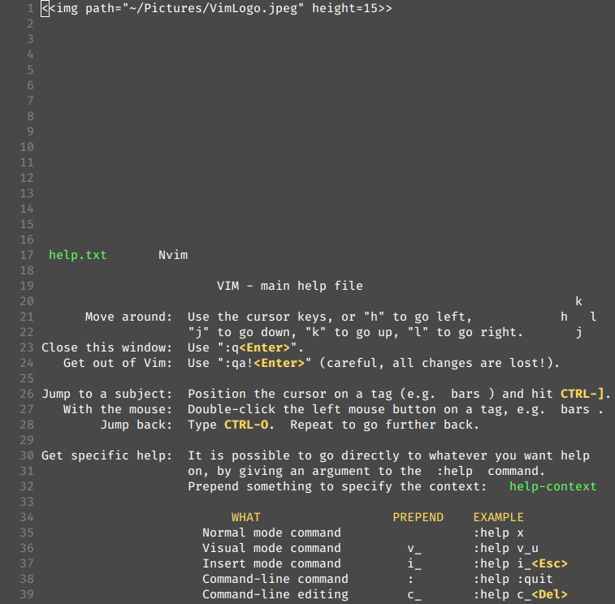
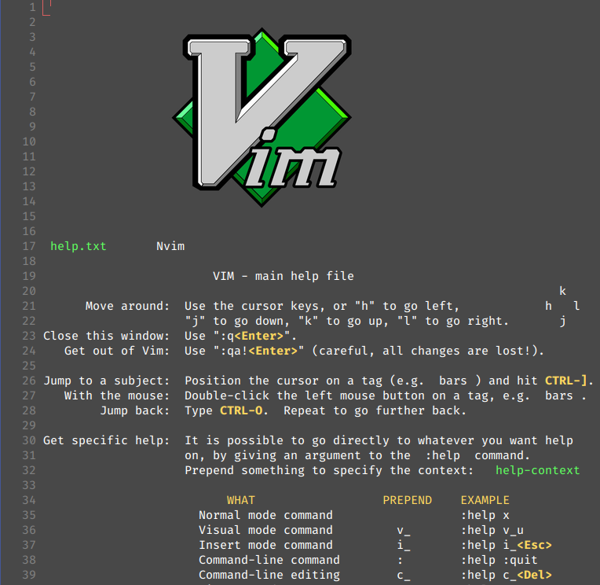

# Vim Imager
Display real images (not just ascii) inside of vim using Überzug
This plugin will only work in terminal vim/neovim and while running X11.

For more information about Überzug check out the github page:\
[https://github.com/seebye/ueberzug](https://github.com/seebye/ueberzug)

## Installation

### Installing Überzug
Make sure that python3 is installed, and run the following command:\
`pip3 install ueberzug`

### Install with Vim Plug
Add the following to your vimrc\
`Plug 'AdamTillou/vim-imager'`

Then reload vim and run the command
`PlugInstall`

### Install with Vundle
Add the following to your vimrc\
`Plugin 'AdamTillou/vim-imager'`

Then reload vim and run the command
`PluginInstall`

## Inserting an Image
Imager will insert an image wherever you place the following text in your file:\
`<>`

For example, to insert the image ~/Pictures/MyImage 5 lines high, you would use:\
`<>`

You can also specify a path relative to the file you are inserting the image into.
If the image you wanted to insert was in the same directory as the file, you could use:\
`<>`\
or alternatively\
`<>`

If the image was in the directory above the current file, its relative path would be:\
`<>`

This dot pattern continues, meaning that for each higher up directory, simply add another dot.
If you wanted to acces the image ``~/MyImage`` from the file ~/Documents/Misc/Notes/MyNote.txt, the relative path would be:\
`<>`

If you wanted to insert images into code, any string of characters can be inserted before or after the image declaration to make it a comment, and it will still work.\
`# <>`\
`// <>`\
`<!--<>-->`

## Configuration
Specify a list of filetypes to enable imager in:\
`let g:imager#filetypes = ['.md']`

Enable imager automatically for all files:\
`let g:imager#all_filetypes = 1`

Disable imager temporarily (for example, to edit the displayed images)\
`:DisableImages`

Enable imager if it is disabled\
`:EnableImages`

Toggle imager being enabled or disabled\
`:ToggleImages`

Forcibly reload all displayed images\
`:ReloadImages`

## Screenshots
#### With imager disabled

#### With imager enabled

